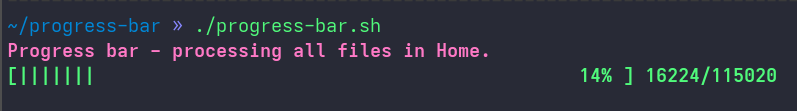

## Progress Bar

Barra de progresso feita em shell script.

O intuito foi de aplicar alguns conceitos de caracteres de escape do bash. Assim, 
foi colocado cores no programa e comportamentos de sobrescrita de linhas, para que
a barra pudesse ser dinâmica e cheia de vida.

## Preview do Projeto

Nesse caso, o programa busca todos os arquivos que estão dentro da Home do usuário.

E quando finalizado, a barra continua mostrando na tela para o usuário.
